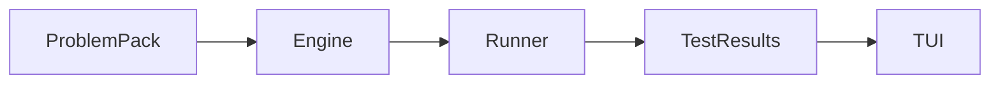

# bugsim

**bugsim** is a terminal “flight simulator” for software engineers: deliberate practice for **implementation under test** and **debugging unfamiliar code**, inspired by how aviation trains pilots to stay proficient when automation handles the easy parts.

## Why this exists

Modern coding workflows increasingly put engineers in a **supervisor** role (reviewing diffs, orchestrating agents) rather than an **operator** role (holding state, forming hypotheses, editing running systems). The skills that atrophy are exactly the ones you need when automation misleads you or hands control back at the worst moment.

Maximilian Walterskirchen’s essay [*Piloting Agentic Engineering*](https://mwalterskirchen.dev/blog/piloting-agentic-engineering/) draws a parallel to aviation: automation improved aggregate safety, but also revealed a new failure mode—**automation dependency**—where humans struggle when they must fly manually again. Aviation’s response was not “remove the autopilot,” but **better training**: manual flight in simulators, explicit *automation management*, and regulators pushing airlines to preserve manual handling skills.

**bugsim is practice tooling** (not an AI product). It is meant to be a repeatable gym session: short, focused scenarios with clear feedback, runnable entirely on your machine.

## Goals

- **TUI-first, keyboard-driven** sessions (primary interface is the terminal).
- **Track A — Implement:** read a spec (`problem.md`), work in a **workspace** copied from `skeleton/`, validate with **automated tests** (including tests shipped under `hidden_tests/`).
- **Track B — Bug review:** read **realistic-ish** broken code and context under `bug/`, then answer in-terminal (v1: **multiple-choice** with automated scoring; later: patches, guided diffs, or external `$EDITOR` workflows—see *Open design questions*).
- **Polyglot packs (v1 contract):** packs declare a **runner id**; the engine invokes a **runner** (declarative command list) to build/test in an isolated temp directory.
- **Local subprocess execution** with strict **timeouts** and **working-directory isolation** per run. This is optimized for **trusted, single-user practice machines**.

## Non-goals (v1)

- Accounts, cloud sync, or competitive global leaderboards.
- LLM grading of free-text explanations.
- Strong multi-tenant sandboxing suitable for running **untrusted** user code from the internet.
- A full IDE debugger embedded in the TUI.

## Threat model and safety

**bugsim executes arbitrary commands defined by:**

1. The **runner** configuration shipped with bugsim (or extended locally by advanced users), and  
2. The **problem pack**’s declared runner + file layout.

**Defaults:**

- Runs should assume **no network is required** for correctness (pack authors should avoid networked tests).
- Packs should be treated like **source code you would compile**: only use packs from authors you trust.
- The engine runs subprocesses with a **timeout** and a **fresh temp dir** per attempt.

**Honest limits:** a local subprocess sandbox is **not** a security boundary against malicious packs. If you need that, run bugsim inside an OCI container/VM and treat optional future “remote runner” support as a separate hardening track.

## Architecture (target)



Recommended implementation stack (this repo):

- **Go** for the CLI + engine.
- **Bubble Tea v2** + **Lip Gloss v2** for the TUI: [bubbletea](https://github.com/charmbracelet/bubbletea).

## Problem pack format (`pack_format_version: 1`)

Packs are directories on disk. A pack **must** contain:

| Path | Purpose |
|------|---------|
| `manifest.yaml` | Machine-readable metadata + track-specific config |
| `problem.md` | Human-readable statement (Markdown) |

### `manifest.yaml` (normative fields)

```yaml
pack_format_version: 1

id: string            # stable id, lowercase kebab-case recommended
title: string
track: implement | bug_review
runner: string        # id of a runner config (see Runners)
difficulty: easy | medium | hard
tags: [string, ...]   # optional

# Optional hints for UX (not enforced by engine in v1)
recommended_minutes: 10
```

#### Track: `implement`

Additional required layout:

| Path | Purpose |
|------|---------|
| `skeleton/**` | Copied verbatim into the run workspace (should include everything needed to `go test`, `pytest`, etc., depending on runner) |
| `hidden_tests/**` | Copied verbatim into the same workspace root **after** `skeleton/` (overwrites on collision—avoid collisions) |

Optional:

| Path | Purpose |
|------|---------|
| `solution/**` | Reference solution for maintainers (never copied to workspace) |

#### Track: `bug_review`

Additional required layout:

| Path | Purpose |
|------|---------|
| `bug/**` | Context for the scenario (Markdown + code snippets) |

Additional required manifest section:

```yaml
bug_review:
  prompt: string            # short question shown in TUI
  choices:
    - id: string
      label: string
      correct: bool          # exactly one choice should be true in v1
```

Future extensions may add `artifacts/` (logs), `timeline/` (incident narrative), or automated patch grading.

## Runners (`runner.json`)

Runners live in this repository under `runners/*.json` and define how to execute tests in a workspace directory.

Example (`runners/go.json`):

```json
{
  "id": "go",
  "commands": {
    "test": ["go", "test", "./..."]
  }
}
```

Rules:

- The engine resolves `{runner}` from `manifest.yaml` to `runners/{runner}.json`.
- The engine executes the `test` argv with `cwd = workspaceDir`.
- Exit code `0` means pass; non-zero means fail.
- Timeouts are applied per invocation (see CLI flags).

Adding a new runner should be **docs + JSON** first, then (if needed) a reference pack.

## CLI UX (target)

```text
bugsim list --packs <dir>          # list valid packs
bugsim verify-pack <packDir>     # validate manifest + layout (+ optional test run)
bugsim play --packs <dir>        # interactive TUI: pick a pack and run
```

Common flags:

- `--packs` root directory containing one subdirectory per pack (default: `./packs`)
- `--timeout` duration for runner test subprocess (default: `2m`)

## Roadmap

1. **Phase 0:** Pack discovery + validation + TUI shell (menu/navigation).
2. **Phase 1:** Implement track end-to-end (workspace materialization + runner + results view).
3. **Phase 2:** Bug review track (MCQ v1).
4. **Phase 3:** Progress/score persistence, richer incident scenarios, optional `$EDITOR` integration.
5. **Phase 4:** Optional hardened execution backends (OCI) for untrusted packs.

## Locked decisions (driving v1)

These are intentional product/engineering choices for the first vertical slice:

- **Execution:** local subprocess + timeout + temp workspace (not Docker-by-default).
- **Languages:** polyglot via **runner JSON**; Go is the **reference** runner used by the seed packs in this repo.

## Open design questions

These are intentionally left open; answers should become GitHub issues or small ADRs as bugsim matures.

**Product and pedagogy**

- Solo practice vs facilitated team drills?
- “CRM-style” forced steps (restate bug → hypotheses → validate → fix)?
- Track B fidelity: minimal repro vs incident timelines/red herrings?
- Random vs spaced repetition?
- Explicit difficulty labels vs opaque surprises?

**Track A**

- Always provide starter files vs empty workspace?
- Hidden tests vs visible tests (learning vs anti-cheat)?
- Partial credit reporting vs all-or-nothing?
- Time limits on by default?

**Track B**

- Move from MCQ to patch submission + automated application + test?
- Single-file vs multi-file scenarios in early packs?
- Automated scoring vs self-scored reveal?

**Technical**

- Minimum Go version policy for contributors.
- Windows support priority vs Unix-first behavior.
- Telemetry: default off vs opt-in (current stance: **none**).
- Pinning toolchains per pack (`toolchain` files, `asdf`, etc.)?

**Distribution**

- `go install`, Homebrew, or release binaries?

## Contributing

- **Packs:** start by copying `packs/_template-implement` or `packs/_template-bug_review` (if present) and run `bugsim verify-pack <dir>`.
- **Runners:** add `runners/<id>.json` and a seed pack that uses `runner: <id>`.
- **Code:** `gofmt` on all Go files; `go test ./...` must pass.

## License

See [LICENSE](LICENSE).
